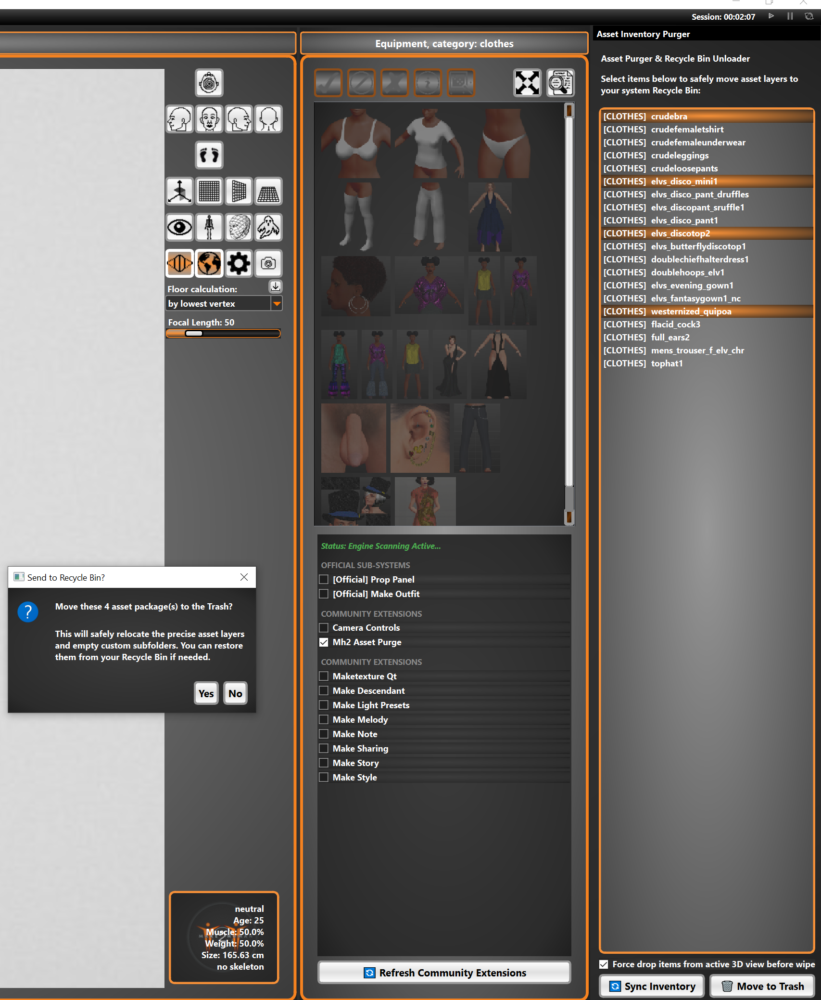

# MH2_Asset_Purge  

A simple asset purge addon/plugin for Makehuman 2. This tool requires MH2 to be utilized. This belongs in the mh2_official_tools folder, own folder named    
exactly mh2_asset_purge, and can be loaded via the community plugins panel. The plugin allows for deleting of all assets in MH2 en masse or one at a time.    
    
Once loaded you will see a list propegated inside this plugin of all installed assets in Makehuman 2. You can select one or many from   
this list and choose to purge them to the trashcan. This way they can be retrieved in the event of a mistaken click. This tool is intended to be used   
for cleanup of your uwanted or un-needed content packs.  
  
# Demo  
  
  
